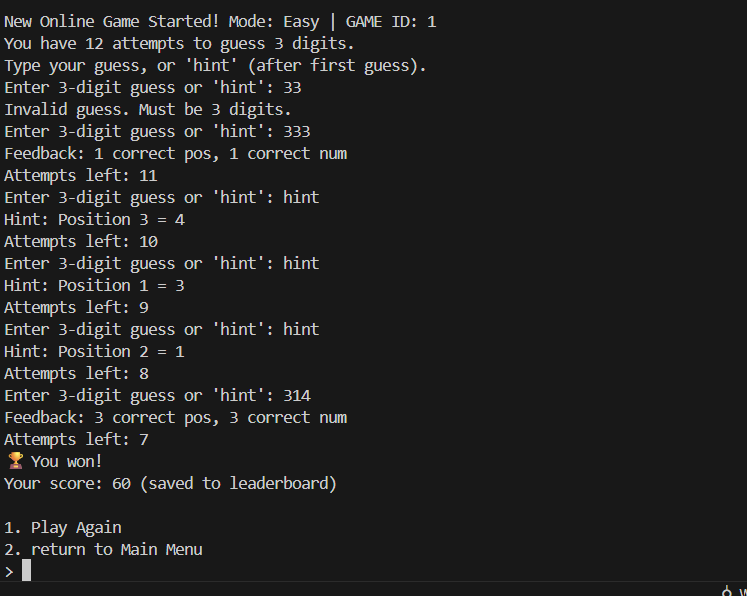
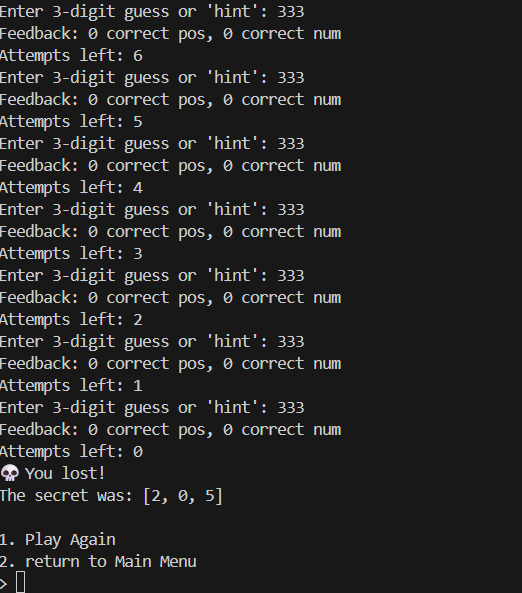
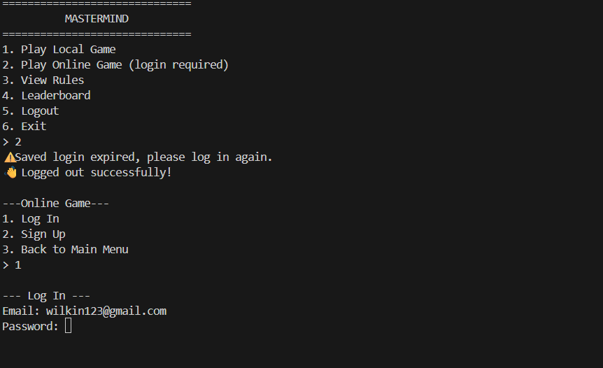

#  Mastermind WR – FastAPI Backend

##  Overview

This project is a modern reimagining of the classic Mastermind game, evolving from my earlier CLI-based version.  
While my first project (`mastermind_game-main`) focused on a local Python game, this new version — **Mastermind WR (FastAPI)** — is a full backend system with:

- API endpoints
- Authentication
- Database persistence
- Hint system
- Scoring and leaderboards

---

##  How to Run the Game

### 1. Clone the repository

git clone https://github.com/wilscooding/mastermind_WR-fastapi.git
cd mastermind_WR-fastapi

### 2. Set Up Virtual Environment

python -m venv .venv

source .venv/bin/activate   # Linux/Mac
.venv\Scripts\activate      # Windows

###3. Install dependencies

pip install -r requirements.txt

### 4. Run the server

uvicorn app.main:app --reload

### 5. Run Python CLI
python cli.py

## 🎲 How to Play

The core rules remain faithful to the original Mastermind board game:

- The system generates a secret code (sequence of digits).
- You try to guess the code within a limited number of attempts.
- After each guess, you receive feedback:
  -  Correct digit in the correct position
  -  Correct digit but in the wrong position
  -  Digit not in the secret at all

###  Backend API Flow

- Start a game → `POST /games/`
- Submit a guess → `POST /games/{id}/guesses`
- Request a hint → `GET /games/{id}/hint`
- View game state → `GET /games/{id}`

Win by cracking the code before you run out of attempts — otherwise, the game is lost!

---

##  Mindset & Thought Process

### 1. Understanding the Game Mechanics

- Randomly generate a secret sequence
- Allow guesses and validate them
- Provide structured feedback until win/loss

### 2. Identifying Core Functionality

- **Game State**: Track secret, guesses, attempts, and outcomes
- **User Accounts**: Link games to players
- **Leaderboard**: Compare performance across users
- **Hints**: Reveal part of the code (strategic trade-off)

### 3. Designing the Structure

- **Domain Layer**: Pure game logic (evaluate guesses, win/loss, hints)
- **Service Layer**: Business rules, scoring, progression
- **API Layer**: FastAPI endpoints for gameplay
- **Database Layer**: SQLAlchemy models for users, games, history

### 4. Crafting the Game Mechanics

- Game creation: Define mode (`easy`, `normal`, `hard`, `custom`)
- Hint system: Reveals digits one at a time, consumes attempts
- Win/Loss state: Persisted for history and leaderboard

---

## ✨ Creative Extensions

Compared to the original CLI version, this backend adds:

-  **Database Integration**
-  **User Authentication (JWT)**
-  **Persistent Game History**
-  **Hint System**
-  **Scoring & Leaderboard**
-  **Rich Feedback API**

---

##  Future Additions

-  **Multiplayer Mode**
-  **Frontend Integration** (Web/Mobile)
-  **Advanced Analytics**
-  **Dockerized Deployment**

---

##  Screenshots

###  Main Menu

###  Game Modes

###  Winning Screen

###  Losing Screen

###  Online Authentication
